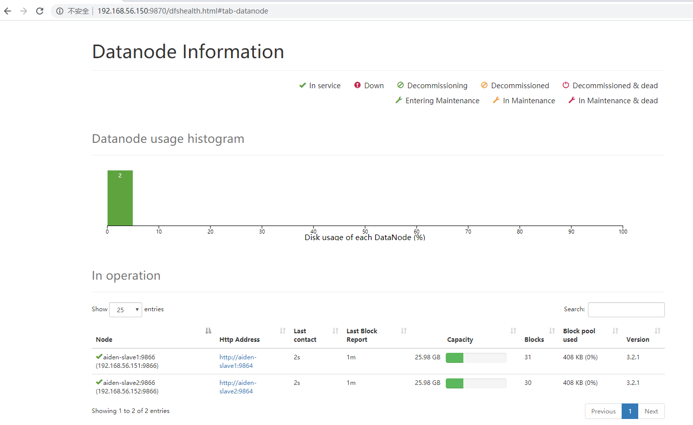
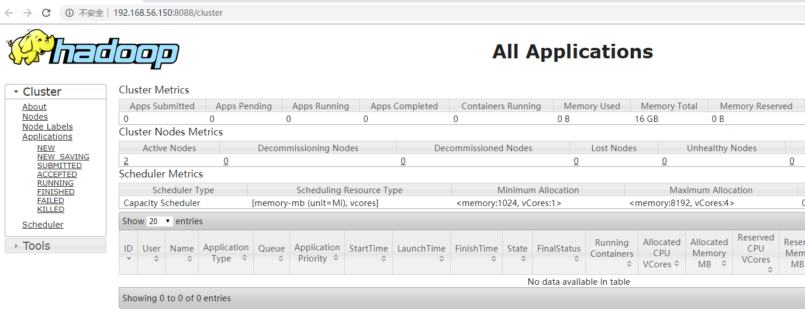

# Install Hadoop Cluster

## References

https://hadoop.apache.org/docs/stable/hadoop-project-dist/hadoop-common/ClusterSetup.html

## Machines

machine | ip address | os | hostname
-|-|-|-
master | 192.168.56.150 | centos 7 | aiden-master
slave1 | 192.168.56.151 | centos 7 | aiden-slave1
slave2 | 192.168.56.152 | centos 7 | aiden-slave2

Set Hostname

For example, on master:
```
hostnamectl set-hostname aiden-master
```

Set hosts
```
cat >> /etc/hosts << EOF
192.168.56.150  aiden-master
192.168.56.151  aiden-slave1
192.168.56.152  aiden-slave2
EOF
```

## SSH

Generate SSH Keys
```
ssh-keygen -t rsa -P '' -f ~/.ssh/id_rsa
cat ~/.ssh/id_rsa.pub >> ~/.ssh/authorized_keys
chmod 0600 ~/.ssh/authorized_keys
ssh localhost
```

Copy Keys between machines
```
ssh-copy-id -i ~/.ssh/id_rsa.pub aiden-master

ssh-copy-id -i ~/.ssh/id_rsa.pub aiden-slave1
ssh-copy-id -i ~/.ssh/id_rsa.pub aiden-slave2
```


## JDK

Install JDK
```
yum -y install java-1.8.0-openjdk java-1.8.0-openjdk-devel
```

vi ~/.bashrc
```
export JAVA_HOME=/usr/lib/jvm/java-1.8.0
export PATH=$JAVA_HOME/bin:$PATH
```

## Installation

```
tar xzvf hadoop-3.2.1.tar.gz -C /usr/local 
```


vi ~/.bashrc
```
export HADOOP_HOME=/usr/local/hadoop-3.2.1
export PATH=$PATH:$HADOOP_HOME/bin

export HADOOP_CONF_DIR=$HADOOP_HOME/etc/hadoop
export LD_LIBRARY_PATH=$LD_LIBRARY_PATH:$HADOOP_HOME/lib:$HADOOP_HOME/lib/native
```

## Configuration

Create folders
```
mkdir -p /root/hadoop/tmp
mkdir -p /root/hadoop/hdfs/name
mkdir -p /root/hadoop/hdfs/data
```

Go to $HADOOP_HOME/etc/hadoop, change

- core-site.xml
```
<configuration>
    <property>
        <name>hadoop.tmp.dir</name>
        <value>file:/root/hadoop/tmp</value>
        <description>Abase for other temporary directories.</description>
    </property>
    <property>
        <name>fs.defaultFS</name>
        <value>hdfs://aiden-master:9000</value>
    </property>
    <property>
        <name>dfs.http.address</name> 
        <value>aiden-master:50070</value> 
    </property>
</configuration>
```

- hdfs-site.xml
```
<configuration>
    <property>
        <name>dfs.replication</name>
        <value>2</value>
    </property>
    <property>
        <name>dfs.name.dir</name>
        <value>/root/hadoop/hdfs/name</value>
    </property>
    <property>
        <name>dfs.data.dir</name>
        <value>/root/hadoop/hdfs/data</value>
    </property>
</configuration>
```

- mapred-site.xml
```
<configuration>
  <property>
      <name>mapreduce.framework.name</name>
      <value>yarn</value>
  </property>
  <property>
    <name>mapreduce.application.classpath</name>
    <value>$HADOOP_HOME/share/hadoop/mapreduce/*:$HADOOP_HOME/share/hadoop/mapreduce/lib/*</value>
  </property>
</configuration>
```

- yarn-site.xml
```
<configuration>
<!-- Site specific YARN configuration properties -->
    <property>
        <name>yarn.nodemanager.aux-services</name>
        <value>mapreduce_shuffle</value>
    </property>
    <property>
            <name>yarn.resourcemanager.hostname</name>
            <value>aiden-master</value>
    </property>
    <property>
        <name>yarn.nodemanager.env-whitelist</name>
        <value>JAVA_HOME,HADOOP_COMMON_HOME,HADOOP_HDFS_HOME,HADOOP_CONF_DIR,CLASSPATH_PREPEND_DISTCACHE,HADOOP_YARN_HOME,HADOOP_HOME</value>
    </property>
</configuration>
```

- hadoop-env.sh

```
export HDFS_NAMENODE_USER=root
export HDFS_DATANODE_USER=root
export HDFS_SECONDARYNAMENODE_USER=root
export YARN_RESOURCEMANAGER_USER=root
export YARN_NODEMANAGER_USER=root
```

- workers
```
aiden-slave1
aiden-slave2
```

## Format Node

Run
```
bin/hadoop namenode -format
```

Check the console output:
```
...
2020-02-22 10:32:07,116 INFO common.Storage: Storage directory /root/hadoop/hdfs/name has been successfully formatted.
...
```
The name node has been formated.


## Start Hadoop and Yarn

On master

1. Run `sbin/start-dfs.sh`

2. Access web ui http://192.168.56.150:9870/



3. Run `sbin/start-yarn.sh`

4. Access resource manager http://192.168.56.150:8088/



## Check

Run `hadoop fs -ls /`

```
hadoop fs -ls /
...
```


Run `jps`

```
[root@aiden-master ~]# jps
3424 NameNode
4099 ResourceManager
3829 SecondaryNameNode
4620 Jps

[root@aiden-slave ~]# jps
3205 DataNode
3462 Jps
3322 NodeManager
```

## Others

Create short cut
```
ln -s /usr/local/hadoop-3.2.1/sbin/start-all.sh start-hadoop.sh
```