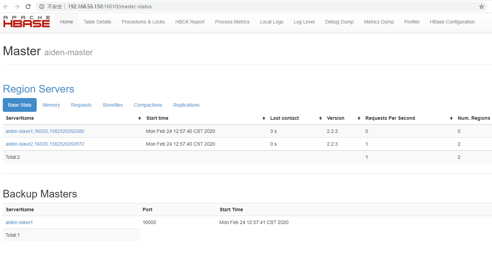

# Install Hbase Cluster

## References

https://hadoop.apache.org/docs/stable/hadoop-project-dist/hadoop-common/ClusterSetup.html

## Machines

machine | ip address | os | hostname | Role
-|-|-|-|-
master | 192.168.56.150 | centos 7 | aiden-master | Master
slave1 | 192.168.56.151 | centos 7 | aiden-slave1 | Regionserver, Master Backup
slave2 | 192.168.56.152 | centos 7 | aiden-slave2 | Regionserver

## Pre-requisites

- Hadoop Installed
- Zookeeper Installed

## Installation

Run
```
tar -zxvf hbase-2.2.3-bin.tar.gz -C /usr/local
```

vi ~/.bashrc
```
export HBASE_HOME=/usr/local/hbase-2.2.3
export PATH=$PATH:$HBASE_HOME/bin
```

## Configuration

Go to conf folder, modify

- hbase-env.sh

```
export HBASE_MANAGES_ZK=false
```


- backup-masters
Create a new file with content
```
aiden-slave1
```

- hbase-site.xml
```
    <property>
        <name>hbase.rootdir</name>
        <value>hdfs://aiden-master:9000/hbase</value>
    </property>
    <property>
        <name>hbase.cluster.distributed</name>
        <value>true</value>
    </property>
    <property>
        <name>hbase.zookeeper.quorum</name>
        <value>aiden-master,aiden-slave1,aiden-slave2</value>
    </property>
    <property>
        <name>hbase.zookeeper.property.dataDir</name>
        <value>/root/zookeeper</value>
    </property>
    <property>
        <name>hbase.unsafe.stream.capability.enforce</name>
        <value>false</value>
    </property>
```

- regionservers
```
aiden-slave1
aiden-slave2
```

## Start Hbase

On master, run
```
bin/start-hbase.sh
```

## Check

- hdfs

Run `hadoop fs -ls /hbase`
```
[root@aiden-master ~]# hadoop fs -ls /hbase
Found 12 items
drwxr-xr-x   - root supergroup          0 2020-02-23 15:33 /hbase/.hbck
drwxr-xr-x   - root supergroup          0 2020-02-23 16:29 /hbase/.tmp
drwxr-xr-x   - root supergroup          0 2020-02-23 16:30 /hbase/MasterProcWALs
drwxr-xr-x   - root supergroup          0 2020-02-23 16:34 /hbase/WALs
drwxr-xr-x   - root supergroup          0 2020-02-23 16:17 /hbase/archive
drwxr-xr-x   - root supergroup          0 2020-02-23 15:33 /hbase/corrupt
drwxr-xr-x   - root supergroup          0 2020-02-23 16:10 /hbase/data
-rw-r--r--   2 root supergroup         42 2020-02-23 15:33 /hbase/hbase.id
-rw-r--r--   2 root supergroup          7 2020-02-23 15:33 /hbase/hbase.version
drwxr-xr-x   - root supergroup          0 2020-02-23 15:33 /hbase/mobdir
drwxr-xr-x   - root supergroup          0 2020-02-23 16:30 /hbase/oldWALs
drwx--x--x   - root supergroup          0 2020-02-23 15:33 /hbase/staging
```

- Web Console

Access web UI: http://192.168.56.150:16010



- jps
```
[root@aiden-master ~]# jps
...
4458 HMaster

[root@aiden-slave1 ~]# jps
...
3659 HMaster
3501 HRegionServer

[root@aiden-slave2 ~]# jps
...
3568 HRegionServer
```

## Client

Run `hbase shell`

```
[root@aiden-master ~]# hbase shell
HBase Shell
Use "help" to get list of supported commands.
Use "exit" to quit this interactive shell.
For Reference, please visit: http://hbase.apache.org/2.0/book.html#shell
Version 2.2.3, r6a830d87542b766bd3dc4cfdee28655f62de3974, 2020年 01月 10日 星期五 18:27:51 CST
Took 0.0023 seconds                                                                    
hbase(main):001:0> status
1 active master, 1 backup masters, 2 servers, 0 dead, 1.0000 average load
Took 0.3158 seconds                                                                    
hbase(main):002:0> list
TABLE                                                                                  
0 row(s)
Took 0.0136 seconds                                                                    
=> []
```


## Others

- Issue: SLF4J: Class path contains multiple SLF4J bindings.

To resolve, Run
```
rm -f /usr/local/hbase-2.2.3/lib/client-facing-thirdparty/slf4j-log4j12-1.7.25.jar
```

