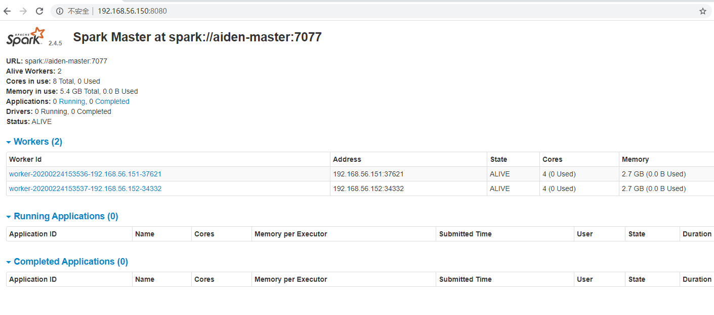

# Install Hbase Cluster

## References

...


## Machines

machine | ip address | os | hostname | Role
-|-|-|-|-
master | 192.168.56.150 | centos 7 | aiden-master | Master
slave1 | 192.168.56.151 | centos 7 | aiden-slave1 | Worker
slave2 | 192.168.56.152 | centos 7 | aiden-slave2 | Worker

## Pre-requisites

- Hadoop Installed
- Scala Installed
- JDK installed

## Installation

```
tar xzvf spark-2.4.5-bin-without-hadoop-scala-2.12.tgz -C /usr/local

mv /usr/local/spark-2.4.5-bin-without-hadoop-scala-2.12 /usr/local/spark-2.4.5

export SPARK_HOME=/usr/local/spark-2.4.5
export PATH=$PATH:$SPARK_HOME/bin
```

Install python3 for pyspark
```
yum install python3
```

## Configuration

- conf/spark-env.sh

cp spark-env.sh.template spark-env.sh

```
export SPARK_DIST_CLASSPATH=$(hadoop classpath)
export PYSPARK_PYTHON=/usr/bin/python3
```

- slaves

cp slaves.template slaves

```
aiden-slave1
aiden-slave2
```

## Start

Run
```
sbin/start-all.sh
```

## Check

- Web Console

http://192.168.56.150:8080/



- JPS
```
[root@aiden-master spark-2.4.5]# jps
...
4877 Master


[root@aiden-slave1 ~]# jps
...
4079 Worker


[root@aiden-slave2 ~]# jps
...
3918 Worker
```


## Client
```
[root@aiden-master ~]# spark-shell
Setting default log level to "WARN".
To adjust logging level use sc.setLogLevel(newLevel). For SparkR, use setLogLevel(newLevel).
Spark context Web UI available at http://aiden-master:4040
Spark context available as 'sc' (master = local[*], app id = local-1582529799775).
Spark session available as 'spark'.
Welcome to
      ____              __
     / __/__  ___ _____/ /__
    _\ \/ _ \/ _ `/ __/  '_/
   /___/ .__/\_,_/_/ /_/\_\   version 2.4.5
      /_/
         
Using Scala version 2.12.10 (OpenJDK 64-Bit Server VM, Java 1.8.0_242)
Type in expressions to have them evaluated.
Type :help for more information.

scala> 

```
